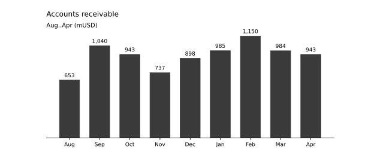
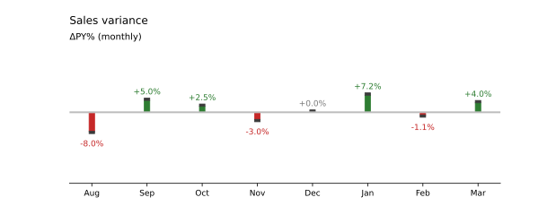
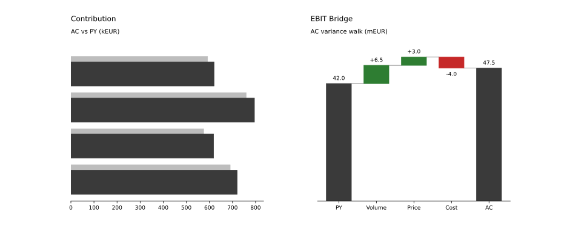
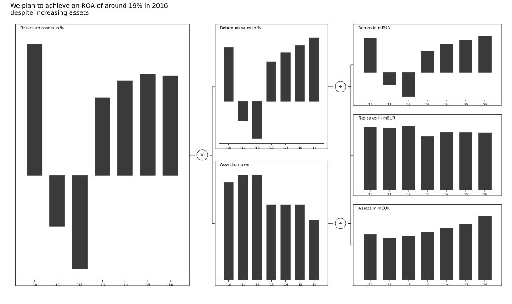

<p align="center">
<pre align="center">
  ___ ____   ____  ____       __  __ ____  _
 |_ _| __ ) / ___|/ ___|     |  \/  |  _ \| |
  | ||  _ \| |    \___ \_____| |\/| | |_) | |
  | || |_) | |___  ___) |____| |  | |  __/| |___
 |___|____/ \____||____/     |_|  |_|_|   |_____|
</pre>
</p>

IBCS-style charting and reporting toolkit built on Matplotlib.

Strict focus:

- semantic notation (scenario, variance, impact)
- composable chart primitives and composites
- extension through registry + plugin system

## Setup (uv)

```bash
uv sync
```

Or with Make:

```bash
make setup
```

Run tests/lint:

```bash
uv run pytest
uv run ruff check
```

Make shortcuts:

```bash
make check
make typecheck
make docs-images
```

Run an example:

```bash
uv run python examples/ex_01_single_column.py
```

## Documentation

- Extending charts: `docs/EXTENDING_CHARTS.md`
- Chart catalog: `docs/CHART_CATALOG.md`
- Specification references and rule IDs: `docs/SPECIFICATION_REFERENCES.md`

## Example Outputs

### Single Column



### Relative Variance Pins



### Grouped Bar + Waterfall



### ROA Tree


